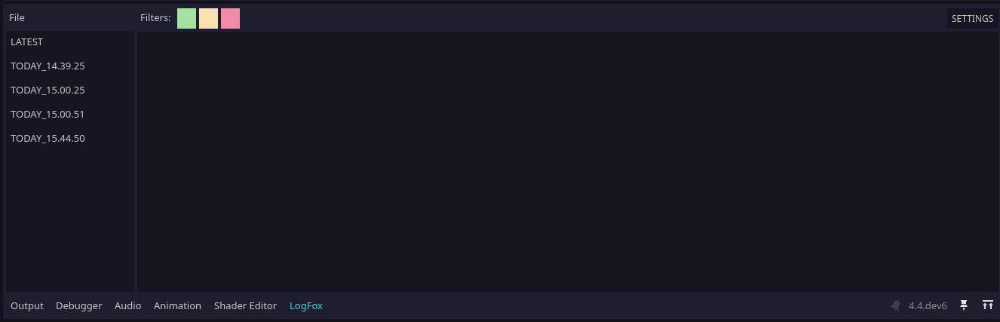
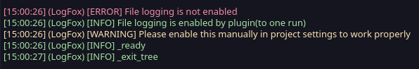

# LogFox

 Simple godot logger plugin with dock to see old logs.





## Usage

### Logging info
```gdscript
LogFox.info("Some info", source_node)
LogFox.warning("Some warning", source_node)
LogFox.error("Some error", source_node)
```
### Log variable values
```gdscript
# Connect it to variable change
LogFox.log_property(source_node, "property_name")
# It can't get function(local) variables, make it global first
```
